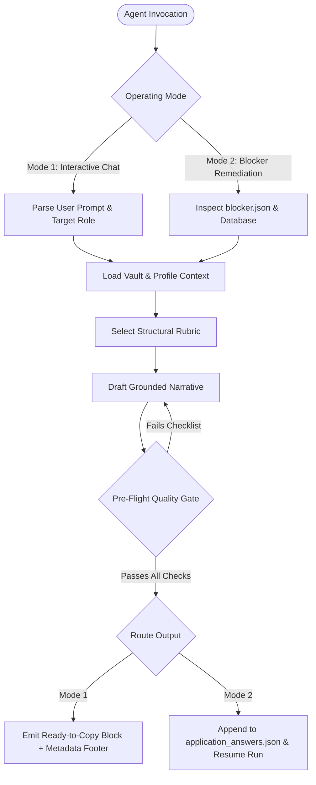

# Agent Workflow: Application Essay & Blocker Resolver

This workflow runbook instructs autonomous and interactive agents on how to execute end-to-end question answering and automated ATS blocker remediation using the `application-essay-writer` skill.

> [!IMPORTANT]
> **Explicit Application Questions Only**: Never invent, guess, or predict hypothetical questions from the job description. The agent only generates answers for questions that are explicitly present in the application form (e.g. via `blocker.json` or explicitly provided by the user).

---

## 1. Overview & Operating Modes

Agents operate in one of two modes when executing this workflow:



---

## 2. Mode 1: Interactive Question Answering

### Step 1.1: Ingest Inputs & Detect Constraints
- **Extract Prompt Intent**: Classify the prompt into one of the 5 core categories (Why Us / Failure & Debugging / Technical Challenge / AI Tools / Leadership).
- **Check Length Constraints**:
  - If a hard limit is given (e.g. "max 150 words", "1000 characters"), treat it as a strict upper bound.
  - If no limit is specified, enforce the standard **120–180 words (1 cohesive paragraph / ~800–1,200 characters)**.
- **Identify Role & Company Context**: Note target company domain (e.g., aerospace, fintech, enterprise SaaS, hardware/semiconductors).

### Step 1.2: Check Answer Bank & Select Grounded Pillar
1. **Search Answer Bank First**: Check `references/answered_questions_index.md` for existing canonical responses matching the question pattern (e.g. development workflow, failure response, AI usage). Adapt and reuse verified narratives directly where applicable.
2. **Read Candidate Vault**: Consult `references/candidate_experience_vault.md` (and active profile `profiles/<profile>/resume.md`):
- **Development Workflow & Context Engineering**: Spec-Driven Development, Context Engineering, Phoenix/OTel, Docker, Atomic Git.
- **Distributed Data / Spark / Cost Optimization**: *Perficient (ACS)* $\rightarrow$ 24h to <1h, $10k/mo EMR savings.
- **IoT Data Quality / Anomaly Detection / MCP**: *EPAM (Baker Hughes)* $\rightarrow$ 95% anomaly catch rate.
- **AI Agents / Document Extraction / Observability & Evals**: *Impatico* $\rightarrow$ 1,000+ reports, Phoenix/OpenTelemetry, precision 50% to 80%.
- **Academic Rigor & Leadership**: *USC MS CS* (3.67 GPA), SHPE Director.

### Step 1.3: Apply Structural Formula
Select the appropriate formula from `references/question_rubrics.md`:
1. **"Why Us?"** $\rightarrow$ **Mission — Bridge — Impact**
2. **"Technical Failure / Debugging"** $\rightarrow$ **STAR-L** (Situation, Task, Action, Result, Learning)
3. **"Technically Challenging Project"** $\rightarrow$ **Depth, Tradeoffs & Retrospective**
4. **"AI Usage in Software"** $\rightarrow$ **Leverage vs. Rigor**
5. **"Leadership / Collaboration"** $\rightarrow$ **Alignment & Shared Ownership**

### Step 1.4: Execute Pre-Flight Quality Gate
The agent MUST verify all 6 items before outputting:
- [ ] **0 company mission summaries / marketing regurgitations**: Open directly with concrete technical problems or candidate engineering work.
- [ ] **0 em dashes (`—`)**: Replaced with clean commas, periods, or parentheses.
- [ ] **0 generic fluff openers**: No *"I am thrilled to apply..."* or *"I have always been passionate about..."*.
- [ ] **0 meta-commentary**: No *"This directly mirrors your requirements..."* or *"This demonstrates my ability to..."*.
- [ ] **Word & character limits strictly satisfied**.
- [ ] **At least 1 verified metric / concrete architectural detail** from the candidate vault.

### Step 1.5: Format Output
Render the response in chat as:
```text
<Generated Essay Text>

[Words: <count> | Chars: <count> | Primary Pillar: <Pillar Name>]
```

---

## 3. Mode 2: Automated ATS Blocker Remediation

When automated job submission (`apply_jobs`) blocks on an open-ended essay question:

### Step 2.1: Locate and Parse Blocker
1. Inspect the blocker artifact at:
   `artifacts/applications/<profile>/<application_id>/blocker.json`
2. Extract:
   - `question_text`: Exact prompt text presented by ATS.
   - `field_name` / `field_type`: Form field identifier.
   - `details.normalized_question`: Normalized key for matching.

### Step 2.2: Fetch Job Context from Database
Query `job_hunter.db` to extract target company, title, and job description:
```sql
SELECT title, company, description, source_metadata
FROM jobs
WHERE id = <job_id>;
```

### Step 2.3: Generate Tailored Response
Execute Steps 1.2 through 1.4 to draft a grounded, constraint-compliant answer matching the ATS field.

### Step 2.4: Persist Override to `application_answers.json`
1. Load `profiles/<profile_name>/application_answers.json`.
2. Append a new entry under `"question_overrides"`:
   ```json
   {
     "match_type": "contains",
     "pattern": "<distinct keywords from question_text>",
     "answer": "<generated response text>"
   }
   ```
3. Validate JSON syntax with `python -m json.tool profiles/<profile_name>/application_answers.json`.

### Step 2.5: Resume Application Run
Run the resume CLI command to verify submission unblocks:
```bash
python -m job_hunter.apply_jobs resume --application-id <application_id>
```

---

## 4. Storage & Logging Convention

Generated essays are bundled directly with the job's tailoring artifacts:
- **Markdown Document:** `artifacts/tailoring/<profile>/<job_id>-<company>-<title>/essays.md`
- **Structured JSON:** `artifacts/tailoring/<profile>/<job_id>-<company>-<title>/essays.json`

---

## 5. Error Handling & Edge Cases

| Scenario | Agent Resolution |
| :--- | :--- |
| **Strict short character limit (<500 chars)** | Compress narrative to 2 sentences: 1 sentence on concrete system built + 1 sentence with verified metric & impact. |
| **Single-line input field (no newlines permitted)** | Strip all `\n` and format as a single continuous paragraph. |
| **Ambiguous or multi-part prompt** | Address each sub-question explicitly within a single unified paragraph without adding section headings. |
| **Role outside core ML/Data (e.g. Frontend/Security)** | Bridge through backend systems, data contracts, and API integration reliability from EPAM/Perficient. |
